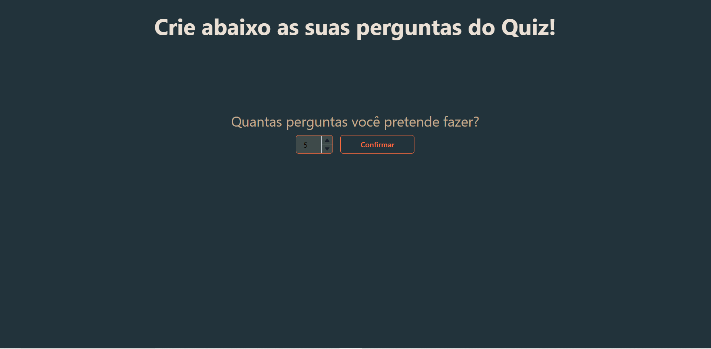
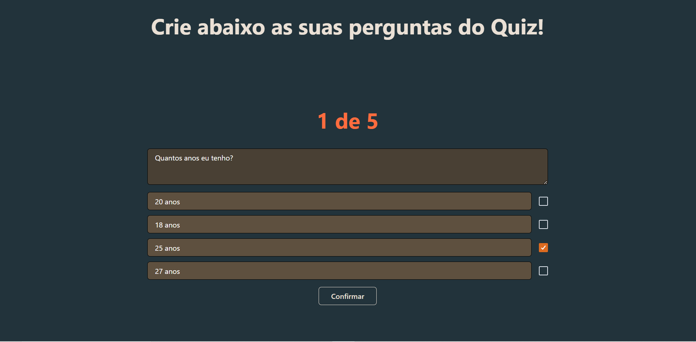
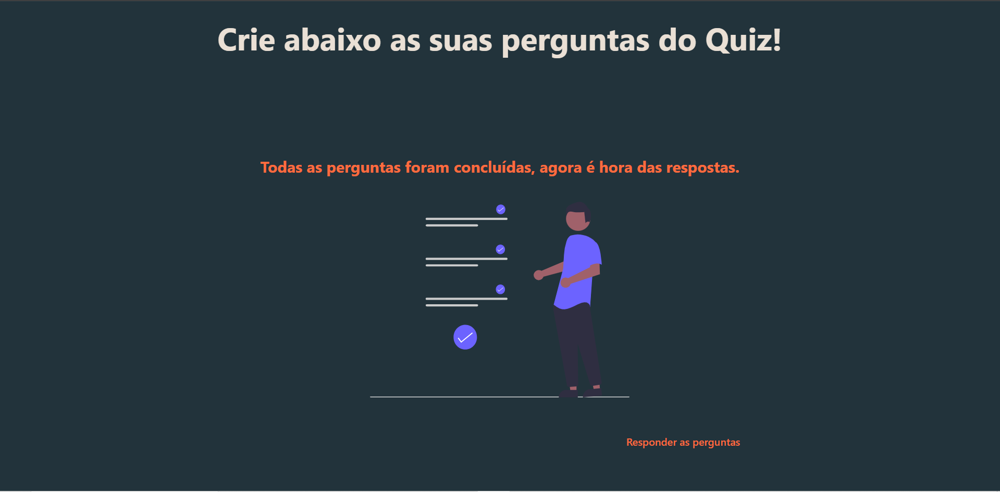
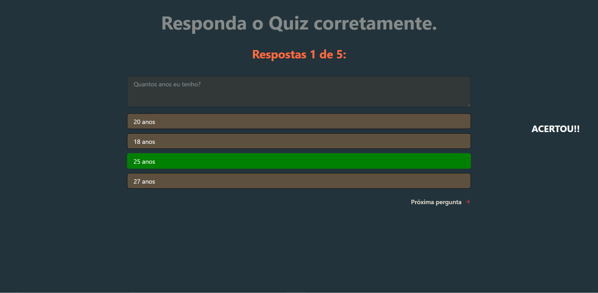
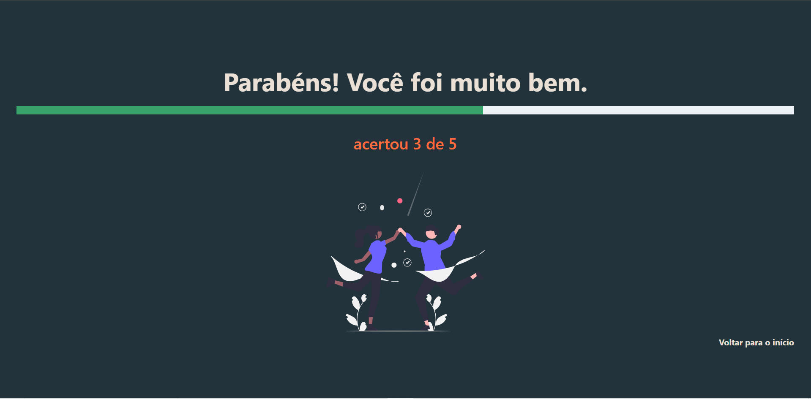
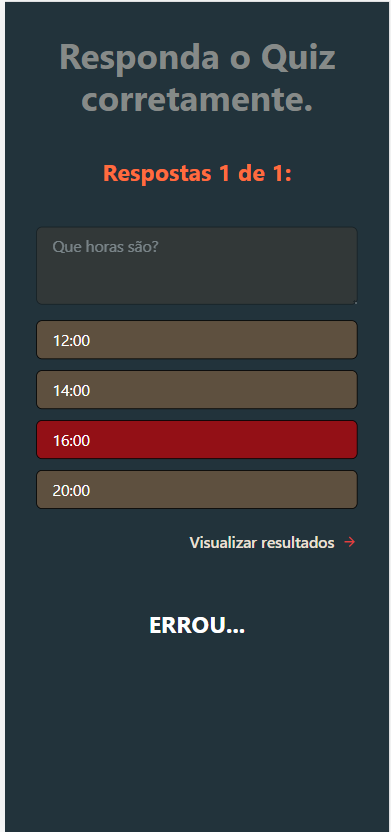

# Quiz

## Descrição do Projeto

O projeto consiste em um empolgante jogo de Quiz, repleto de perguntas e respostas. Inicialmente, o participante responsável pelas perguntas tem a liberdade de selecionar tanto a quantidade quanto o conteúdo das questões que farão parte do jogo. Em seguida, o participante encarregado das respostas escolhe as alternativas correspondentes.

O projeto foi desenvolvido com o objetivo de proporcionar uma divertida brincadeira para casais ou amigos, permitindo que eles descubram o quanto realmente se conhecem.

<h1 align="center">
    <a href="https://quiz.rafaelborges.dev.br/">🔗 Quiz</a>
</h1>

🚀 Aplicação web Quiz

<strong>Selecionar quantidade de questões</strong>

<strong>Perguntas</strong>

<strong>Perguntas concluídas</strong>

<strong>Pergunta selecionada</strong>

<strong>Resultado</strong>
 

<strong>Tela responsiva</strong>
 

### 🛠 Utilizar

Para utilizar localmente:

<ul>
	<li>clonar o repositório do github</li>
	<li>rodar o comando > git clone link-copiado</li>
	<li>rodar o comando > npm install</li>
	

### 🛠 Tecnologias

As seguintes ferramentas foram usadas na construção do projeto:

- [Next](https://nextjs.org/)
- [React](https://pt-br.reactjs.org/)
- [TypeScript](https://www.typescriptlang.org/)
- [Chakra UI](https://chakra-ui.com/)

 
  
 <b>Rafael</b></a>

Feito por Rafael Borges 👋🏽 Entre em contato!

 

